# A selection of exercises from the textbook "Technical Drawing" by Giesecke, Mitchell, Spencer, & Hill

Preliminary edition copyright 1933, these are from the Fifth Edition, Seventh printing in 1970.

## Figure 6-50 Missing-View Problems

Many of these are trivial with a CAD modeling, but, it can require a close look at the Figure for each exercise to get it right.

And example solution for each, created in FreeCAD, is provided in the associated folder in this repository. Since these are from a textbook teaching drafting, in most cases, the example includes a FreeCAD TechDraw page. (*Note: all examples may be a work in progress...*)

## Figure 6-50-1

## Figure 6-50-2
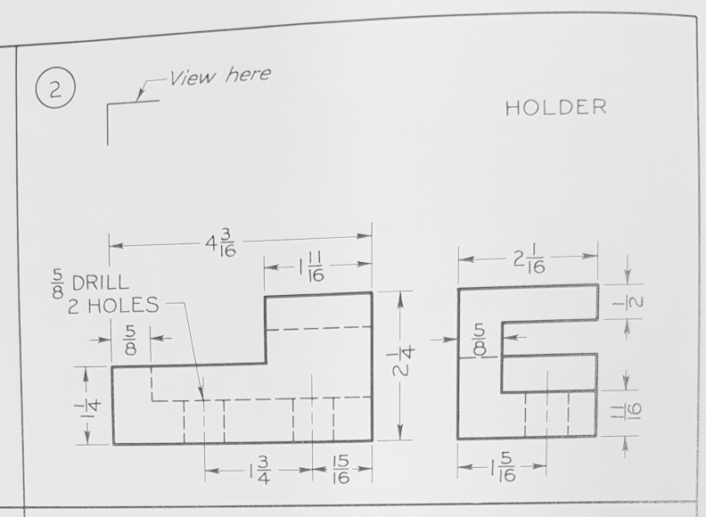
## Figure 6-50-3
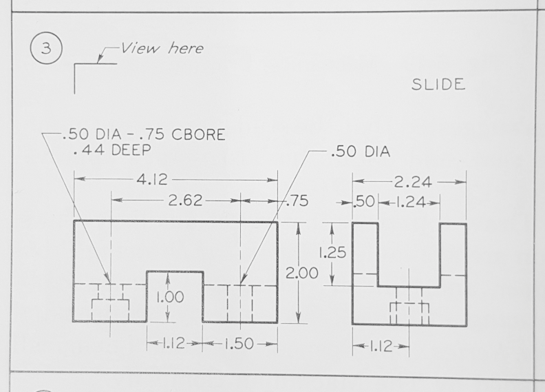
## Figure 6-50-4
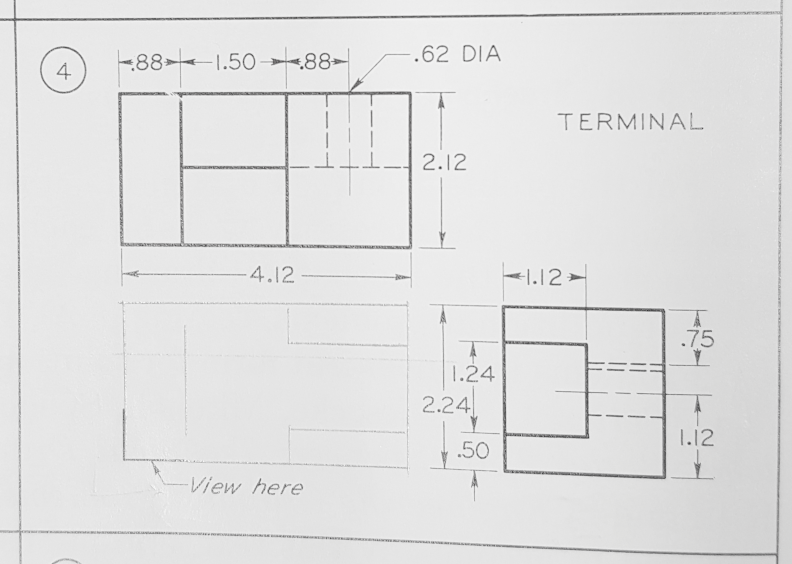
## Figure 6-50-5
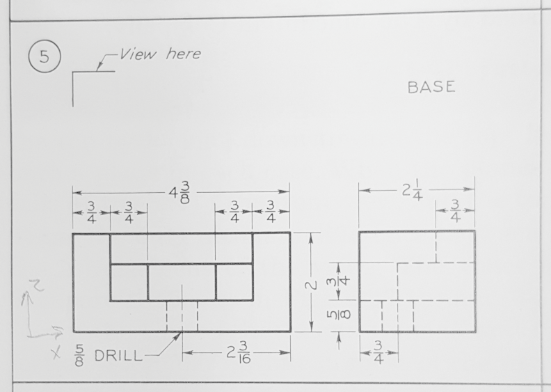
## Figure 6-50-6
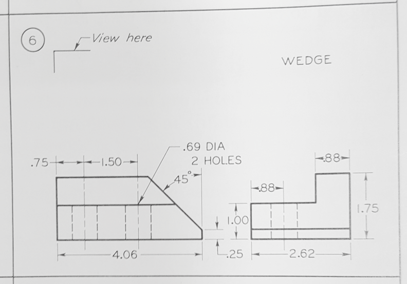
## Figure 6-50-7
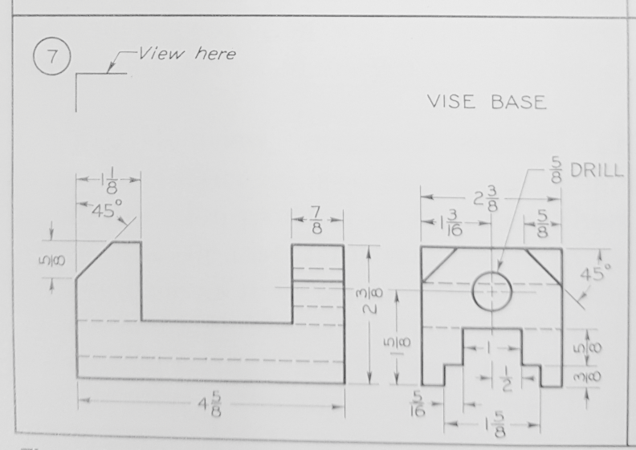
## Figure 6-50-8
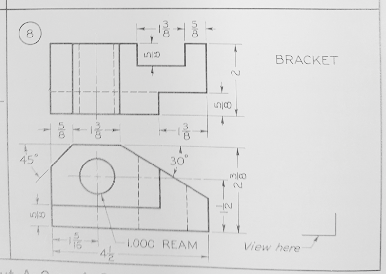
## Figure 6-59
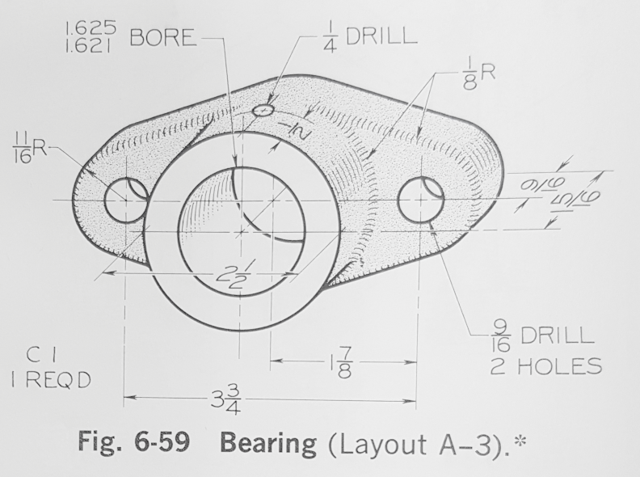
## Figure 6-60
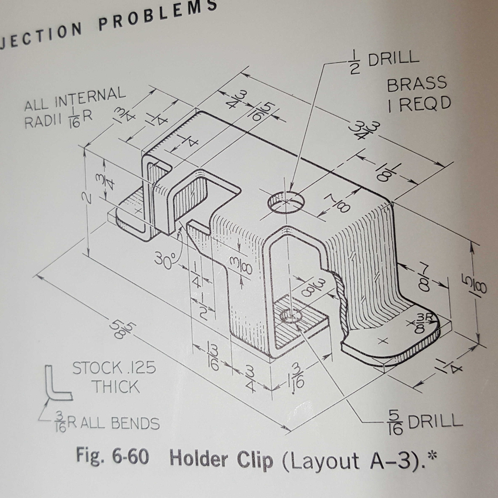
## Figure 8-49
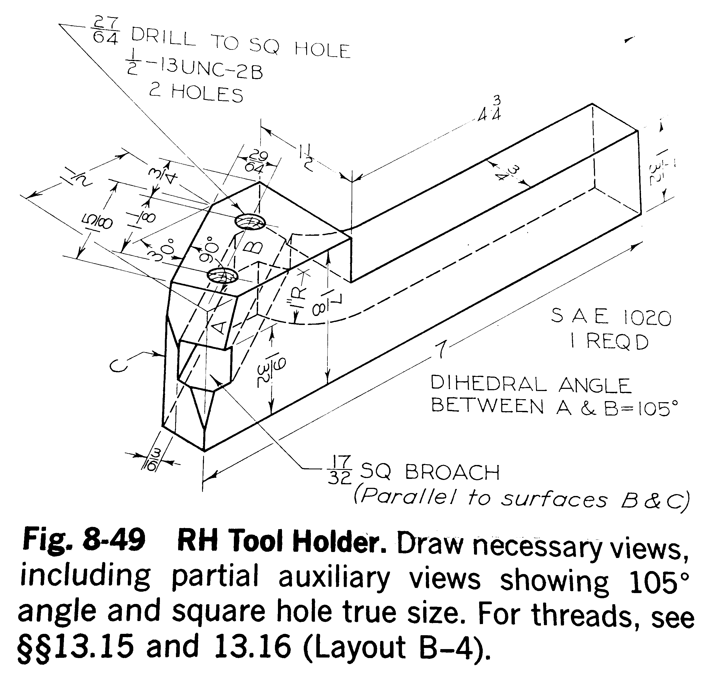
## Figure 8-56
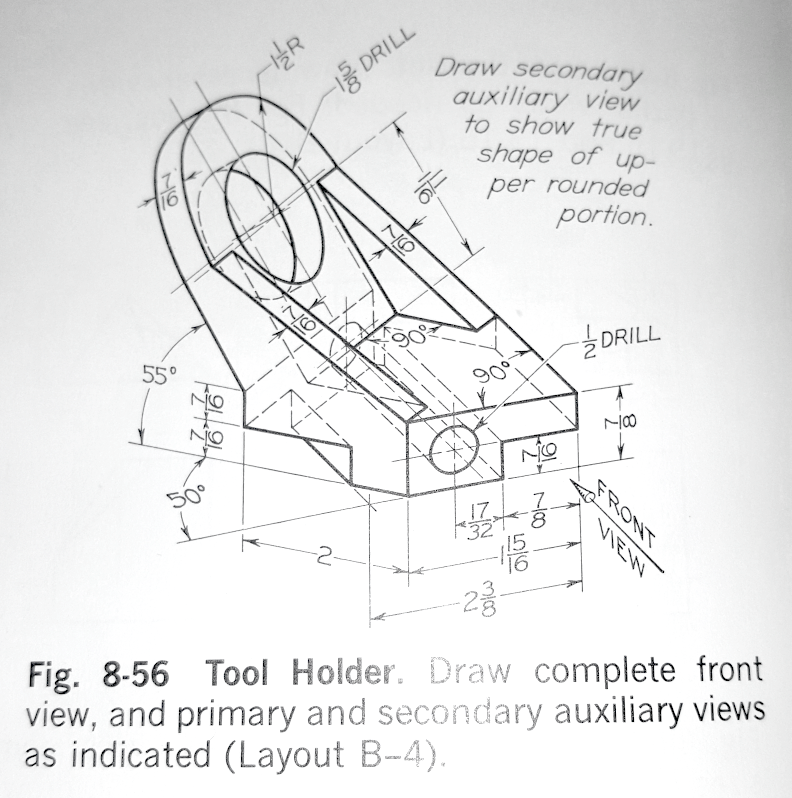
## Figure 8-57
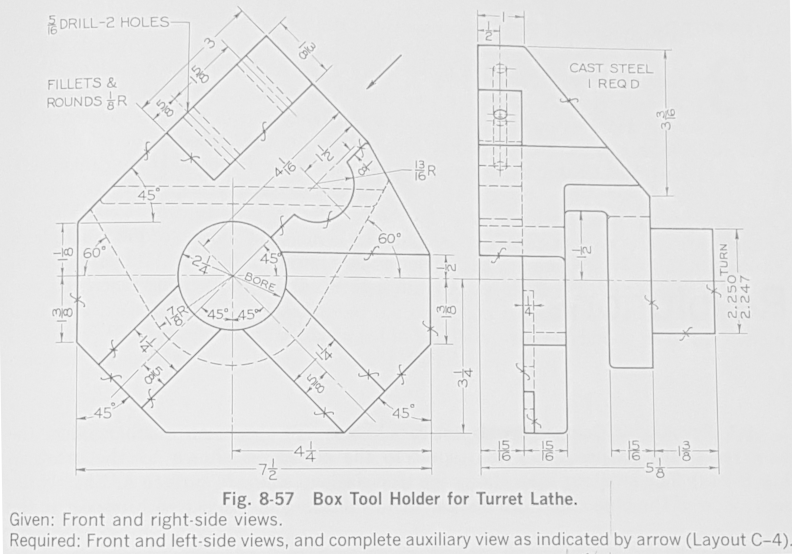
## Figure 8-58
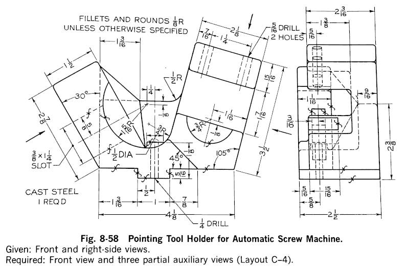

