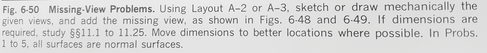
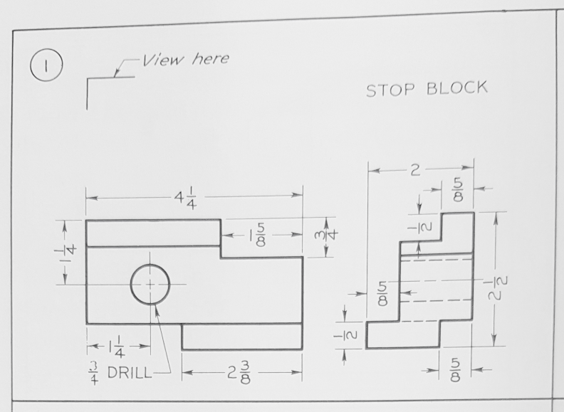

# A selection of exercises from the textbook "Technical Drawing" by Giesecke, Mitchell, Spencer, & Hill

Preliminary edition copyright 1933, these are from the Fifth Edition, Seventh printing in 1970.

## Figure 6-50 Missing-View Problems

## Figure 6-50-1

